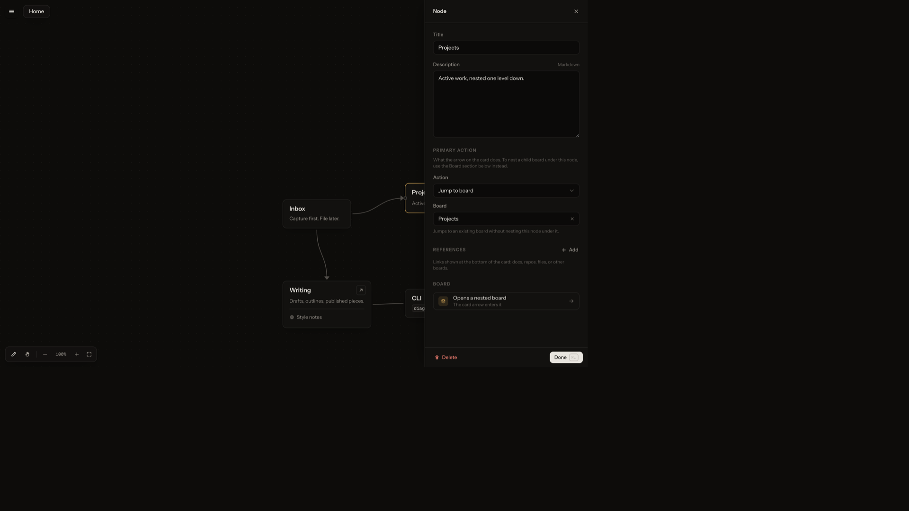

# DiagramKit



A hierarchical spatial board tool for creating mind maps and workflows.

## Install

Node 18+. From a checkout:

```sh
./install.sh
diagramkit serve
```

That puts `diagramkit` on `~/.local/bin` and starts the app in the background at [http://127.0.0.1:3001](http://127.0.0.1:3001).

```sh
diagramkit create ~/my-workspace
diagramkit open ~/my-workspace
diagramkit stop
```

`diagramkit help` lists the rest (`status`, `logs`, `validate`, flags for port and host).

`diagramkit serve` uses the production UI in `dist/`. `npm run dev` (and `diagramkit serve --dev`) uses live source. After UI changes, `diagramkit serve` rebuilds if source is newer; hard-refresh or `diagramkit stop && diagramkit serve` if a process was already running.

From source without installing: `npm install && npm run dev` (UI at http://localhost:5173).

## How it stores data

Default workspace: `~/.diagramkit` (`index.json` + `boards/<id>.json`). Attach any other folder of that shape. The registry is `~/.diagramkit/workspaces.json`.

## Agents

Install, skills, and the “don’t touch the human’s boards” rules: [AGENTS_README.md](AGENTS_README.md).
