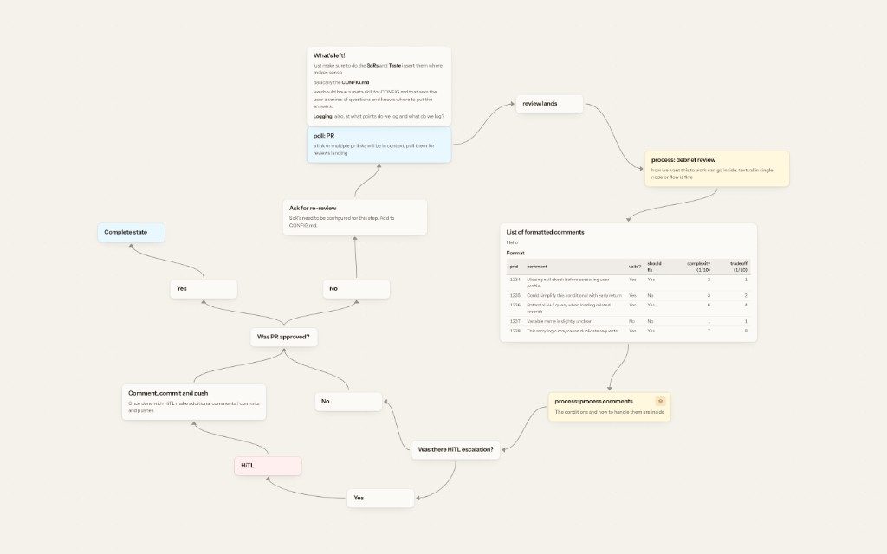

<p align="center">
  
</p>

<h1 align="center">DiagramKit</h1>

<p align="center">A hierarchical spatial board tool for creating mind maps and workflows.</p>

<p align="center">
  
</p>

## Install

Node 18+. From a checkout:

```sh
./install.sh
diagramkit serve
```

That puts `diagramkit` on `~/.local/bin` and starts the app in the background at [http://127.0.0.1:3001](http://127.0.0.1:3001).

To install it as a Mac app, open that URL in Safari and choose **File → Add to Dock**. In Chrome, use the install icon in the address bar. Use `http://127.0.0.1:3001` (localhost counts as a secure context).

```sh
diagramkit create ~/my-workspace
diagramkit open ~/my-workspace
diagramkit stop
```

`diagramkit help` lists the rest (`status`, `logs`, `validate`, `export`, flags for port and host).

`diagramkit serve` uses the production UI in `dist/`. `npm run dev` (and `diagramkit serve --dev`) uses live source. After UI changes, `diagramkit serve` rebuilds if source is newer; hard-refresh or `diagramkit stop && diagramkit serve` if a process was already running.

From source without installing: `npm install && npx playwright install chromium && npm run dev` (UI at http://localhost:5173).

## Export PNGs

The in-app download button (top right) and `diagramkit export` both screenshot a board after Fit to view. Nested children (`enterBoardId`) are included by default — a zip of PNGs. Hover the download button for a **Children** switch (remembered). `--no-children` exports only the current board as a PNG.

```sh
diagramkit export
diagramkit export "Auth service" --theme dark --out ./auth-export.zip
diagramkit export --no-children
```

## How it stores data

Default workspace: `~/.diagramkit` (`index.json` + `boards/<id>.json`). Attach any other folder of that shape. The registry is `~/.diagramkit/workspaces.json`. Undo/redo lives in `boards/<id>.history.json` next to the board. Each step is tagged UI or CLI. The open UI reloads when an agent saves through the API.

## Agents

Install, skills, and the “don’t touch the human’s boards” rules: [AGENTS_README.md](AGENTS_README.md).
